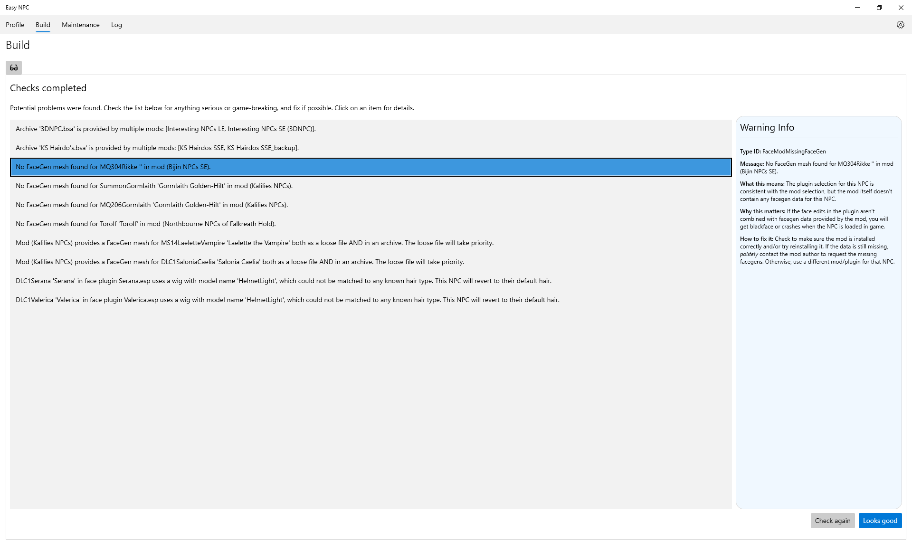

<table><tr><td width="880px">
  <h3>🛑 This documentation is obsolete and will soon be removed.</h3>
  
For the latest, most up-to-date documentation, please head over to the <a href="https://github.com/focustense/easymod/wiki/EasyNPC-%E2%80%90-Home">EasyNPC Wiki pages</a>.

</td></tr></table>

# Build Warnings

EasyNPC has a set of built-in "preflight checks" before starting a build. While every effort is made to provide detailed explanations within the app, some people may still be confused, or wonder why a particular warning matters - or conversely, why it _doesn't_ seem to matter and they can get away with ignoring it. This page provides additional context on these warnings.

In case this document becomes out of date, the full list of warnings and warning text can always be found [in the source](../Build/BuildWarnings.cs).

Build warnings are what show up on the Build tab when you "Check for problems":

The types of checks and warnings currently implemented include:

- `ModDirectoryNotSpecified` - You didn't specify the location where your mods are installed when first running the app, or any time afterward.
  - This might also happen if your configuration got lost, for example after moving to a new machine or restoring a backup.
  - Without this, EasyNPC can't match plugins with assets, and any output it might generate is effectively useless.
  - To resolve, go the Settings tab (gear icon) and set up your mod directory.

- `ModDirectoryNotFound` - A mod installation folder is specified, but doesn't actually exist.
  - This could be because the path is incorrect, or was moved, or is no longer reachable, such as on an external hard drive or network drive that is no longer connected.
  - The consequences of this are the same as not specifying a mod directory at all.
  - Resolve by updating this setting, reconnecting the drive, etc.

- `MultipleArchiveSources` - Some required assets are in a BSA (archive), and more than one mod has that archive
  - This is very commonly a false positive if you make backups of mods, or have multiple versions of a mod but only use one. EasyNPC doesn't know which ones are enabled, so it reports a conflict.
  - During the build, the specific archive that is actually used will be the one that "wins" in your mod order, i.e. belongs to the mod with highest priority/lowest order. If multiple mods providing the archive are all installed _and enabled_, this may not be correct.
  - Mod Organizer's Data tab can tell you if this archive really has conflicts. If there are no conflicts, the warning can be ignored.
  - A future update may be able to reliably use the archive from the specific mod chosen, irrespective of mod/load order. For now, this is not supported.

- `FaceModNotSpecified` - No face selection was made for that NPC. This is a rare warning that should never show up under normal conditions, typically only when a profile was manually edited in a text editor.
    - Without a specified mod, it is not possible to match plugins with assets for that particular NPC, and the only choice is to skip them entirely, i.e. your generated mod will not include changes for this NPC at all.
    - To resolve, go to the Profile tab, locate this NPC and select a face mod.

- `FaceModNotInstalled` - The face mod selected for this NPC doesn't exist.
  - The most likely cause is the mod actually not being installed, i.e. the face was selected base on a mugshot and ignoring the "Mod not installed" warning.
  - This can also happen if a mod was deleted or renamed.
  - Consequences and solution are the same as `FaceModNotSpecified`.

- `FaceModPluginMismatch` - The NPC points to a face plugin that doesn't belong to the NPC's current face mod.
  - The most likely cause is using the Ctrl+Click override to force a selection without synchronization.
  - Another potential cause is that the mod still exists, but is disabled. EasyNPC doesn't know that it is disabled, but is still indirectly affected by disabling the mod because it can no longer see the plugin. As a result, it will fall back to some other plugin that no longer matches the mod.
  - This warning means, with extremely high likelihood, that the NPC record and facegen won't match, and will blackface in game. Don't ignore it.
  - To resolve, fix this NPC in the profile. If it was caused by a mod accidentally being left disabled, close EasyNPC, re-enable the mod and start EasyNPC again.

- `FaceModMissingFaceGen` - The NPC's face mod doesn't have a FaceGen file.
  - This warning isn't your fault, but it may (not always) indicate a problem with the mod itself.
  - In the example screenshot above, the missing FaceGen for Torolf in Northbourne NPCs is a confirmed bug by the author. Kalilies NPCs has the same "issue", but does not have any problems in the game itself.
  - One way to test if the warnings are serious is to activate the warning mod in a vanilla profile and spawn that NPC, i.e. using `player.placeatme <id>` in the game console (don't save after doing this). If you don't see any problems, then the warning is safe to ignore.
  - If there is a real issue with the mod, then the workaround is to choose a different mod for that NPC.
  - You can also try to create FaceGen manually using the Creation Kit and copy it into the mod, but this process can be hit-or-miss, as you need to be using the same morphs as the mod author to end up with the same result.

- `FaceModExtraFaceGen` - The mod includes a FaceGen file for this NPC but does _not_ make any record edits.
  - In principle, this has the same risks as `FaceModMissingFaceGen`. If the two are out of sync, in-game bugs can occur.
  - In practice, mod authors generally only do this when they've done "sculpting" but not actually swapped vanilla head parts for custom ones, which is safe.
  - As with `FaceModMissingFaceGen`, testing against a vanilla load order is recommended, but these warnings are more likely to be benign.
  - If in doubt, or if it fails a basic test, switch to a different mod.

- `FaceModMultipleFaceGen` - There are two FaceGen files, one in an archive and one in a regular (loose) file.
  - A common reason for this is if the original author provided their mod as an archive (or you converted it to one), and subsequently released a hotfix containing loose files. In this case, the warning should be ignored, as the behavior of EasyNPC - prioritizing the loose file - will be the expected behavior and the same behavior as the game.
  - This can also occur by accident if an archive was manually extracted, or manually created but the files were not cleaned up. The warning is still ignorable in this case, as the files should be identical. However, you may still want to clean up the mod.
  - One instance where this may actually represent a real error is if the original mod came with loose files, and you installed a newer version of the mod over top of it that uses a BSA. The loose files will still have priority over the BSA, even if the latter is newer.

- `FaceModWigNotMatched` - The selected mod gives a wig to the NPC, which isn't natively supported, and can't be converted to hair because the wig records didn't give enough clues as to which hair was originally used, or the original hair mod (typically KS Hairdos or ApachiiHair) is not installed.
    - Wig conversion or "de-wiggification" is an experimental feature and likely to fail a lot of the time.
    - The result will not be blackface or crashes, but instead of the custom "hair" that the mod is supposed to provide, the NPC will use vanilla hair and not have the wig.
    - Currently there is no workaround other than to use a different mod for this NPC, or edit your generated mod in xEdit to carry over the wig.

- `FaceModWigNotMatchedBald` - This is exactly the same as `FaceModWigNotMatched`, except that the mod also removes vanilla hair, so instead of reverting to their default hair, they will be bald.

- `FaceModWigConversionDisabled` - Same as `FaceModWigNotMatched` or `FaceModWigNotMatchedBald`, but you turned off wig conversion when setting up the build. This has the same outcome as trying and failing to convert the wig to hair, and the same applicable workarounds.