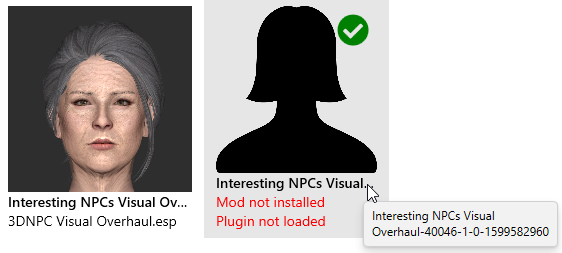
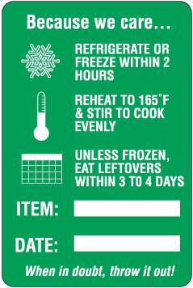
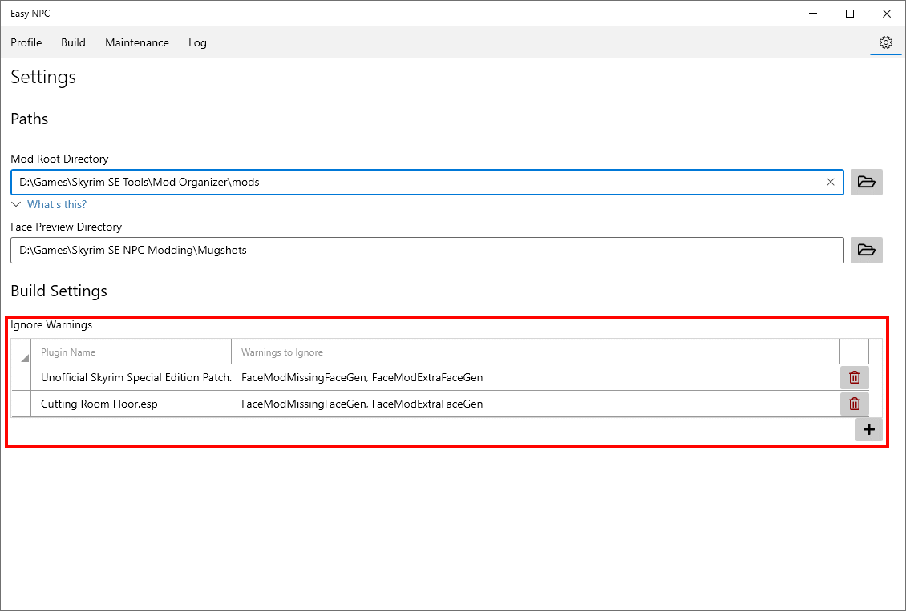
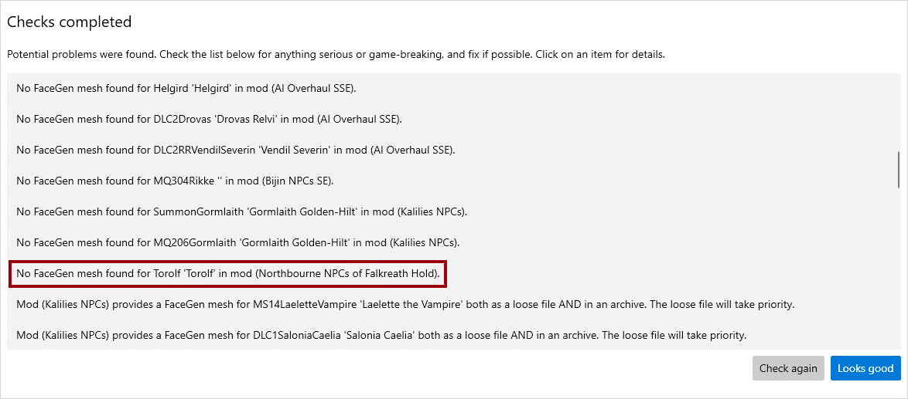
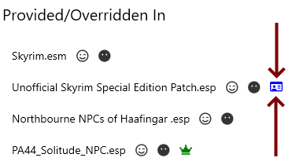
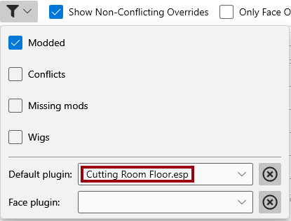

# FAQ and Troubleshooting Guide

* [General Questions](#general-questions)
  + [Will there be a version for Skyrim LE/VR/etc.?](#will-there-be-a-version-for-skyrim-levretc)
  + [Does this support [favorite mod]?](#does-this-support-favorite-mod)
  + [Will you release previews/mugshots for [specific mod]?](#will-you-release-previewsmugshots-for-specific-mod)
* [Starting EasyNPC](#starting-easynpc)
  + [The app doesn't start (nothing gets displayed).](#the-app-doesnt-start-nothing-gets-displayed)
  + [The app starts, but I get an error during the loading screen.](#the-app-starts-but-i-get-an-error-during-the-loading-screen)
* [Profile & NPC Settings](#profile--npc-settings)
  + [Why are "face mod" and "face plugin" different settings?](#why-are-face-mod-and-face-plugin-different-settings)
  + [Why do see a "not installed" option with preview, next to a similar option without a preview?](#why-do-see-a-not-installed-option-with-preview-next-to-a-similar-option-without-a-preview)
  + [Why do see an _installed_ option with preview, next to a _not installed_ option with no preview?](#why-do-see-an-installed-option-with-preview-next-to-a-not-installed-option-with-no-preview)
  + [Which patches do I need to disable, and why?](#which-patches-do-i-need-to-disable-and-why)
  + [Why do I need to disable "non-standalone" AIOs?](#why-do-i-need-to-disable-non-standalone-aios)
  + [Why did EasyNPC pick a vanilla plugin/incorrect plugin as the "default"?](#why-did-easynpc-pick-a-vanilla-pluginincorrect-plugin-as-the-default)
* [Builds](#builds)
  + [What should I do if there are many "missing facegen" or "extra facegen" warnings?](#what-should-i-do-if-there-are-many-missing-facegen-or-extra-facegen-warnings)
  + [What should I do about \[X\] warning?](#what-should-i-do-about-x-warning)
  + [My mod has dependencies on the original overhauls. Isn't EasyNPC supposed to eliminate those?](#my-mod-has-dependencies-on-the-original-overhauls-isnt-easynpc-supposed-to-eliminate-those)
* [Game Issues](#game-issues)
  + [The game doesn't start, or hangs at the loading screen.](#the-game-doesnt-start-or-hangs-at-the-loading-screen)
  + [Some NPCs are headless, or have floating eyes/hair.](#some-npcs-are-headless-or-have-floating-eyeshair)
  + [Some NPCs are bright white/purple, or parts of their head are.](#some-npcs-are-bright-whitepurple-or-parts-of-their-head-are)
* [Other problems?](#other-problems)

---

## General Questions

### Will there be a version for Skyrim LE/VR/etc.?

[Issue #32](https://github.com/focustense/easymod/issues/32) is the tracker for VR support; it is likely to happen, but not guaranteed. The answer for all other Skyrim versions, aside from SE and VR, is "maybe".

At some point, a preview build will be released that will enable testing with other instances via a command-line switch. This feature will need testers before it can become part of the official build. If you are interested _and willing to spend some time testing, reporting issues and trying out fixes_, please ping that issue and/or the [EasyMod Discord](https://discord.gg/E4a6XfRvHe).

### Does this support [favorite mod]?

EasyNPC supports **all** mods, regardless of whether or not there is a preview pack available. The preview pack allows you to see what the NPCs from that mod will look like, but is not required to use the mod.

There is one notable and temporary exception to this: EasyNPC cannot automatically reconcile conflicts with mods that do any of the following:

- Change an NPC's race.
- Change the head parts of a vanilla race.
- Change the meshes for a vanilla headpart.

Almost no overhauls do this, so virtually all overhauls are supported. Two notable exceptions are Ethereal Elven Overhaul (modifies vanilla races) and Vanilla Hair Replacer (modifies vanilla head parts). These will be handled in the very near future, and _can_ be made to work today, but currently require some manual steps in the mod manager and/or xEdit, which are too complex to document here in full.

### Will you release previews/mugshots for [specific mod]?

Eventually, but since it is a laborious manual process, it may take time. For those who have volunteered to make their own, the [mugshot creation guide](making-mugshots.md) may help. In the meantime, there is now a [dedicated Discord channel](https://discord.gg/hyV8r8heDj) for making these requests, where other people can vote on them.

## Starting EasyNPC

### The app doesn't start (nothing gets displayed).

A few rare crash situations have mostly been resolved, so be sure you're running the latest version.

EasyNPC currently only supports Skyrim Special Edition. If you're trying to run it on a Legendary Edition ("Oldrim") installation, it won't start. Same with VR. See the [VR/LE support question](#will-there-be-a-version-for-skyrim-levretc) for more details on if/when these may be available.

If none of this applies, you should be able to find the specific crash report in your Windows event log:

> Start/Windows Menu -> Event Viewer -> Windows Logs -> Application.

Look for an error with a Source of `.NET Runtime`, whose first line says `Application: EasyNPC.exe`. Copy the details of this into the issue report; without this information, it may not be possible to fix.

### The app starts, but I get an error during the loading screen.

This could be either a problem with one of your plugins, a bug in EasyNPC's loader, or both. Usually it is both, i.e. a plugin does something it's not supposed to do, but it's still a bug because EasyNPC should be able to handle the situation with a warning rather than a crash.

The error message will contain a link to a log file. Please open an issue on GitHub and include the contents of that file. Either attach the file, or use a site like [Pastebin](https://pastebin.com), [ControlC](https://controlc.com) or [ZeroBin](https://zerobin.net).

Over time, there should be fewer and fewer of these errors; since EasyNPC is still in beta, please be patient while we work out the kinks.

If you can't wait and/or would rather try to troubleshoot the problem yourself, you can try disabling plugins. Vortex users may find it easier to do this in EasyNPC's loading screen, where you can shift-click to select several plugins at once, and then hit the space bar to enable/disable all of them. Any changes that you make on this screen are only for the current EasyNPC session; they will not affect your mod manager, nor will they affect any future runs of EasyNPC.

Be aware that if you start EasyNPC with a plugin disabled, it has no chance of being selected as the default/face for any NPC, even if it normally should be, and you will have to manually correct it (or reset your profile) later on. If you can wait for an analysis and/or fix, it is usually the better option.

The generic error message that is displayed on screen conveys no useful information, so please **don't** post screenshots, descriptions of your load order, theories on which mods might be responsible, etc. Log files are _always_ required to investigate these particular bug reports, and this is one of the rare instances where additional context tends _not_ to be helpful, unless you have already positively ID'ed the plugin that is causing the problem by being able to successfully load with that plugin disabled.

## Profile & NPC Settings

### Why are "face mod" and "face plugin" different settings?

This may seem overly complicated for an "easy" tool, but it is necessary for a few different reasons:

1. A mod may have several plugins - for example, the Pride of Skyrim overhaul. Moreover, it is possible for more than one of those plugins to modify the same NPC. This is why it is not enough to choose just a mod - the plugin name is also required.

2. A plugin may be provided by more than one mod. While this is far less common than (1), there is a type of patch known as an "ESP replacer" that does this on purpose. You may also have multiple variants of the same mod, and if so, then EasyNPC needs to know which one you intend to use.

3. For those wondering why the "mod" matters at all, i.e. why can't we _only_ choose the plugin? This is because in order to create a _standalone_ mod, EasyNPC needs to copy assets from the source mod. If it copies the wrong assets, you'll have the wrong NPC appearance, or a broken NPC.

Importantly, EasyNPC automatically syncs your face mod and face plugin settings for each NPC, and so most of the time, this detail is not anything that you need to think or worry about it. You can choose a mod, _or_ choose a plugin, and if you're not in one of the situations above, you'll get the same outcome either way. There are only a few situations in which this suddenly becomes important:

- You've renamed a mod, or had multiple variants of a mod and deleted the variant that was actually in use by EasyNPC.
- You're trying to reference a patch, including a non-standalone "AIO patch", instead of the actual overhaul.
- You're running from Vortex, or on a Vortex-managed instance, without the EasyNPC Vortex Extension (the app will warn you prominently about this), or you did so in the past and have leftover profile entries from that attempt.
- You're running from Vortex and it is missing some of the metadata for this mod (rare).

Several of these situations are described in questions further down.

### Why do see a "not installed" option with preview, next to a similar option without a preview?

> 

Mod Organizer and Vortex sometimes use different names for installed mods, or you may have chosen a different name when you installed it. As a result, the name of the mugshot pack doesn't perfectly match the name of the mod.

You can fix this easily with a synonym. Refer to the [Matching Face Previews](mugshot-matching.md) guide.

### Why do see an _installed_ option with preview, next to a _not installed_ option with no preview?

> 

This "ghost mod" is appearing because it is in your profile - note the green checkmark - but _not_ in your game. EasyNPC will always show an option for your current selection, even when it's no longer valid, so that you can see where it is pointing and change it if necessary.

Typical reasons for this are that a mod was renamed or deleted. Vortex can cause this unintentionally in a few different ways, e.g. by reinstalling with a different variant name or by having started EasyNPC the first time without using the EasyNPC Vortex Extension.

Why not automatically fix these discrepancies on app start? Because you may have _unintentionally_ removed/renamed a mod or disabled a plugin, and the philosophy of EasyNPC is that you shouldn't permanently lose part of your profile because you happened to start the app one time under the wrong Mod Organizer profile or while you happened to be messing around with mods.

This situation has come up more than originally anticipated (tends to be Vortex-specific), so a feature is being added that will allow you to fix _all_ invalid face references in a single click. It is not available yet, and this FAQ will be updated once it is. In the meantime, one manual workaround is available:

1. Export your profile from the Profile page (  button).
2. Open the exported file in a text editor ([Notepad++](https://notepad-plus-plus.org/downloads/) is a good choice).
3. Search for all instances of the obsolete/invalid mod name (in this case, `Interesting NPCs Visual Overhaul-40046-1-0-1599582960`) and replace it with the correct one (in this case, `Interesting NPCs Visual Overhaul`).
    * 💡 **TIP:** If you're finding that searching for the "mod name" also finds instances of the "plugin name", you can narrow it down by including the plugin name in the search. For example, instead of searching for `Northbourne NPCs of Haafingar`, search for `Northbourne NPCs of Haafingar .esp|Northbourne NPCs of Haafingar` and adjust the "replace" string accordingly.
4. Save the file in your text editor.
5. Import the profile back (  button).

This should fix all instances of the ghost mod.

### Which patches do I need to disable, and why?

**What:** Any patches that have the purpose of making a "visual overhaul" compatible with some other mod. Also, any "All-in-One" patches that are **not** standalone, i.e. still require you to have parts of the original mods installed. Examples include:
- The `AI overhaul patch` file from [Pandorable's NPCs](https://www.nexusmods.com/skyrimspecialedition/mods/19012?tab=files) (not the main file)
- [USSEP - The Ordinary Women - AI Overhaul Patch](https://www.nexusmods.com/skyrimspecialedition/mods/41371)
- [Bijin All In One](https://www.nexusmods.com/skyrimspecialedition/mods/11)

**Why:** Several reasons.
- They contain many non-visual edits, so EasyNPC may treat them as masters until you override its choice (see the [dependencies](#my-mod-has-dependencies-on-the-original-overhauls-isnt-easynpc-supposed-to-eliminate-those) question below).
- They usually do not copy the overhaul's assets (facegens, other meshes and textures, morphs, and so on), and so if selected as the face mod/plugin, EasyNPC will not be able to find those assets when you build, leaving you with broken or blackfaced NPCs (see [headless](#some-npcs-are-headless-or-have-floating-eyeshair) below).
  - _Note that EasyNPC will only try to copy assets from the mods you have actually selected - it will not copy assets from anywhere they happen to be sitting in your game data. If it did the latter, you would end up with an enormously bloated mod, possibly hundreds of GB._
- They simply aren't necessary, and usually - with the exception of [body replacers](https://github.com/focustense/easymod/issues/7), which will be supported soon - do a worse job of patching than EasyNPC could, because they are built for a very specific set of masters, whereas EasyNPC will use whatever masters you happen to have.

**Boring Nitpick:** It is not truly necessary to _disable_ these patches, only to make sure that EasyNPC is not _using_ them in any profile entries. By far the easiest way to ensure that EasyNPC does not use them is to have them disabled when you run EasyNPC. The alternative is manually fixing all of the profile entries that end up pointing to these patches.

Patches you **shouldn't** disable are anything that does not deal with NPC appearances/overhauls. For example, the patches in [AI Overhaul SSE - Official Patch Hub](https://www.nexusmods.com/skyrimspecialedition/mods/35823?tab=files) make the AI overhaul mod compatible with Cutting Room Floor and various town expansions. These don't interfere with EasyNPC, and EasyNPC doesn't duplicate their functionality.

### Why do I need to disable "non-standalone" AIOs?

This is mostly answered by the previous question, but confuses enough people to warrant a dedicated response.

The [Pride of Skyrim AIO](https://www.nexusmods.com/skyrimspecialedition/mods/48904) is a full mod, put together by the original author, and contains all of the _assets_ required by all of its plugins. This mod really has it **all** in one, and is completely OK and recommended to use.

The [Bijin All In One](https://www.nexusmods.com/skyrimspecialedition/mods/11) _does not have assets_. The **"all"** here is misleading. It is an _ESP merge_, with some additional patching, but still requires all of the original assets from the Bijin mods, and the author says so.

When you install the "Bijin AIO" mod as per the author's instructions, you break the dependency chain between Bijin records (the ESP) and Bijin assets - they are no longer both contained within a single mod. Instead, you have one mod with missing assets (the AIO), and 3 mods with unused assets (the original Bijin mods, with plugins deleted/hidden/moved). These work together, collectively and "implicitly" in the game, but neither EasyNPC nor any other merge tool has any idea about this dependency.

As a result, EasyNPC will fail to copy the required assets from the AIO - because they are not _in_ the AIO, they are in other mods - and you will end up with [headless NPCs](#some-npcs-are-headless-or-have-floating-eyeshair) and other problems.

Since EasyNPC merges all of your NPC edits into one mod, you don't need to continue using AIO patches to save on load order slots.

### Why did EasyNPC pick a vanilla plugin/incorrect plugin as the "default"?

This question refers to what you get when you load EasyNPC for the first time. If you're really wondering about a mod that it's already built, you may be looking for the "dependencies" question below.

A simplified explanation of EasyNPC's default (master) detection algorithm is as follows: Pick the **last** plugin in the load order which:
- Is not ITM (Identical to Master) or ITPO (Identical to Previous Override), i.e. it actually _changes_ something about that NPC in your current setup.
- Changes more about an NPC than just their visual appearance (face, body, outfit).
- Is not part of a mod that "seems like" a visual overhaul, i.e. one where _most_ of the NPC edits are just visual.
- Is not below the detected _face plugin_ in the load order - although it can be the same plugin.

There are more rules, but this is the basic principle. Almost none of these checks are 100% reliable, so there is a certain probability that something will go wrong:
- ITPO detection can be tricked by a vast array of "unused" or "unknown" fields in the Bethesda record structure, as well as some equality-comparison quirks in the Mutagen library.
- Some visual overhauls _accidentally_ edit other attributes, or intentionally edit them because of a decision the author made on a whim.
- Similarly, some ostensibly non-visual mods don't stay in their lane, and decide to make several changes to face attributes and/or facegens.
- If the face-plugin detection is overly conservative and guesses too high in the load order, that affects the default as well.

None of this means that the implementation is considered perfect, or set in stone, or something that you need to deal with. In fact, anyone who sees this behavior is encouraged to submit a bug report identifying the NPC and what the app decided to choose - a profile screenshot showing that NPC's settings works well for this. This detection has improved vastly since the initial alpha release, and can probably be improved vastly more.

What it does mean that EasyNPC won't always get everything right on the first try - it's more like 95-98% right. Most of the time, you won't even notice the issue in game, but sometimes this could result in reverting a bug fix from USSEP or USMP, or causing some other problem. Please help make the app better by reporting the specific details of these, and in the meantime, work around the issue on your end by correcting the selection (click on plugin -> "Set as default").

## Builds

### What should I do if there are many "missing facegen" or "extra facegen" warnings?

All warnings tell you that there _might_ be a problem, but that is not guaranteed. Consider this analogy:

> 

This label is telling you what is **known to be safe**. Chances are, at some point in your life, you left food out for longer than 2 hours, or cooked to less than 165° F, or left something in the refrigerator for a week, and did not get sick. There are even techniques that break these rules on purpose, such as dry-aging and sous-vide. If you are too paranoid about breaking these rules, then you're going to eat a lot of bland meals. On the other hand, this doesn't mean you should eat from a pizza box that's been sitting on the kitchen counter for two days and gathering ants. (The author is _not_ speaking from experience - it's a hyperbolic, hypothetical example.)

Getting back to Skyrim NPCs: the _safe_ thing is for every facegen mesh to be accompanied by an NPC record edit, and vice versa. EasyNPC is a little bit smarter than this - for example, it knows the difference between plugins that edit NPC faces and plugins that edit other aspects of an NPC - but at the present time, these build checks are not sophisticated enough to determine with pinpoint accuracy if a mod that breaks this unwritten "rule" is OK. Many of them are, such as the Unofficial Patch and Cutting Room Floor.

If you are seeing a large number of these warnings for a mod that you have used extensively already, and know that it doesn't have problems, then you can add a mod-level rule to ignore the warnings:

On the other hand, you shouldn't ignore every warning, because some of them are real bugs in the mod. In the Northbourne NPCs mod, Torolf was actually missing a facegen:

You will in some cases have to use your own judgment based on what you know about the mod and your own risk tolerance, which is why EasyNPC reports the warning but still allows you to proceed. If you don't mind the possibility of an occasional blackface, or can afford to test these NPCs in an actual game instance (`player.placeatme` is your friend), then you can ignore almost all of them, just wait and see. If you don't want to waste time testing, or if encountering an issue in the game would completely ruin your experience and by extension your whole day, then do the safe thing and pick a different face mod/plugin.

"When in doubt, throw it out" - if you're risk averse and never want to see another burnt face.

Note that a future enhancement, issue #59, should significantly reduce the rate of false positives, at which point this FAQ will be updated.

### What should I do about [X] warning?

First, click on it, to see what the in-app help text says about that warning. Every warning comes with a detailed explanation of the reason, potential consequences, and possible steps to remedy. There's also a [warning doc](build-warnings.md) with a little more detail.

Second, if the warning is specific to an NPC and you have some idea how to fix it, double-click on it to jump directly to that NPC.

If you don't think it sounds important, you can ignore it and build anyway. Try it in the game and see. If you see blackface, or some of the specific face issues described below, then you may at that point want to return to the warning and resolve it - usually by making different selections.

If, after all of the above, you are still having trouble making sense of a warning, we may be able to help in the [Discord chat](https://discord.gg/E4a6XfRvHe).

### My mod has dependencies on the original overhauls. Isn't EasyNPC supposed to eliminate those?

Any plugin that you set as "default", for _any_ NPC, will cause that plugin to become a master of the generated mod:

> 

In the example above, by selecting it as the default, we've made USSEP a dependency of our NPC mod. USSEP is a normal dependency to have, but other plugins may not be. Even one NPC pointing to a default plugin, from a profile of a thousand NPCs, will cause this dependency.

There are two possible reasons for this to happen - either (a) you added it, or (b) EasyNPC added it when it scanned your load order. If it's (b), then most of the time, it is because your load order included patches or non-standalone AIOs for NPC overhauls. It could also be a bug in the app's detection.

To track down which NPCs are creating the dependency, use the filter settings on the Profile page:

> 

In the above example, this will filter the list of NPCs to any that are currently referencing Cutting Room Floor as a default (i.e. master).

Take careful notice of _all_ the masters that your EasyNPC mod depends on. It may "indirectly" depend on a plugin because of a direct dependency on a _patch_ for that plugin. This is why it is recommended to disable NPC overhaul compatibility patches and non-standalone AIOs before first load, but these can still be fixed after the fact.

Issue #17 will improve the workflow so that you can see what the masters will be _before_ creating the mod, instead of having to fix it afterward.

## Game Issues

### The game doesn't start, or hangs at the loading screen.

EasyNPC modifies NPCs and only NPCs - the mod it creates may have other records, but these will be duplicates of records from other plugins, not modifications of them. Only NPCs are actually modified.

The best troubleshooting method is therefore to delete NPCs from the EasyNPC mod, in order to to determine which one (or more than one) is causing the problem. The "binary search" or "bisect" method is recommended. For non-programmers or anyone unfamiliar with the term, this means:

1. Open the mod in xEdit, and delete half the NPCs (shift-click to select multiple, then right-click -> Delete).
2. Save, making sure you create a backup.
3. Try to start the game again.
4. If it starts, revert to the backup and return to step 1 but delete the _other_ half.
5. If it still does not start, _don't_ revert to backup, go to step 1 and delete half of the _remaining_ NPCs.
6. Keep repeating until you're down to just 1 record, or until the culprit is obvious to you - this is the NPC that's responsible.

In past instances, it's been unusual for more than one NPC to cause such a problem, but if this is the case, you can go back to any of your previous backups, delete the NPCs you've already identified as culprits, and start the search again from step 1.

Although this process might sound tedious, you can find the culprit in just 10 iterations for a mod that includes over 1000 NPCs. This process should not take more than 10-15 minutes.

If you've found the culprit, please report it as a bug! It may be that EasyNPC has failed to copy something correctly, or broken a patch elsewhere in your load order.

### Some NPCs are headless, or have floating eyes/hair.

This is a missing mesh. The most common reasons why this would happen are:

- A patch or non-standalone AIO was chosen instead of the overhaul.
  - For reasons explained earlier, EasyNPC will be unable to find the required resources for merge, so that when you disable the original mods, those resources will be missing.
- A dependency of an overhaul mod was disabled, but is still required.
  - For example, many overhaul mods require the assets from KS Hairdos, and if you've incorporated those overhauls into EasyNPC, then disabling KS Hairdos will result in bald NPCs.
  - Similarly, Northbourne NPCs and Pride of Skyrim depend on assets from High Poly Head, so if you've disabled High Poly Head, then any NPCs you sourced from these mods will be "faceless".

If you can't identify the reason for the missing mesh this way, then you can use a tool such as [Process Monitor](https://docs.microsoft.com/en-us/sysinternals/downloads/procmon) to help find the culprit. Some steps for this are:

1. Have a save game with as little activity as possible, such as the Alternate Start dungeon, with **no** other NPCs in the cell.
2. Start Procmon.
3. For your filters, add the rules:
   - `[Process name]` `[is]` `[SkyrimSE.exe]`
   - `[Path]` `[contains]` `[meshes\]` (You could also put `textures` if you were looking for a missing texture.)
   - `[Result]` `[is not]` `[SUCCESS]`
4. Press OK to start monitoring and filtering.
5. Start the game and load your save game.
6. Switch back to Procmon and press <kbd>Ctrl</kbd>+<kbd>X</kbd>, or select "Clear Display" from the Edit menu. Everything that has been generated so far is irrelevant.
7. Now, spawn the NPC that is having problems with `player.placeatme <formid>`.
   - Replace `<formid>` with the actual ID of that NPC, as reported by EasyNPC or xEdit.
   - You can also get the form ID by typing `help "name"` into the console where `name` is all or part of the NPC name or editor ID - you may have to press <kbd>PgUp</kbd> several times to find the right entry if you do it this way.
8. As soon as you see the NPC spawn with their missing face - or any other missing part - exit the game and/or stop capturing in Procmon (press <kbd>Ctrl</kbd>+<kbd>E</kbd> or unselect "Capture events" from the File menu)

You should have a list of all the meshes which are _potentially_ the source of the problem. Now you need to cross-check this against the meshes that are in EasyNPC's BSA file or files. You can use [BSA Browser](https://www.nexusmods.com/skyrimspecialedition/mods/1756) for this, or, if you use Mod Organizer, you can right-click the BSA in the "Data" tab and choose "Preview".

Whichever mesh files you see in Procmon that are _not_ in the BSA are the ones that are missing. You can either copy these manually into the EasyNPC mod from the source mod (it's OK to leave them as loose files), or temporarily switch this NPC to a different face mod/plugin which doesn't have the same issue.

If the root cause turns out _not_ be user error, i.e. not one of the common reasons described at the top, then **please consider reporting your findings in a bug report.** Most of these issues should have been solved, but there may be some edge cases where EasyNPC is really failing to copy some assets that should be present.

Note that there are other ways to find missing meshes and textures, which have been documented on various Skyrim/SSE forums in the past, and all of them are valid, but the way above is usually the fastest. It does not require you to scrub through plugins or search all your mods or game assets. You can find a missing mesh in under 5 minutes this way.

### Some NPCs are bright white/purple, or parts of their head are.

This is a missing texture.

Aside from being a different type of resources, and being slightly more likely to have been caused by a bug in EasyNPC due to the ability of mods to define alternate textures in various places, it is otherwise the same category of problem as a missing mesh and should be handled the same way.

## Other problems?

Ask a [question on GitHub](https://github.com/focustense/easymod/discussions) or join us in the [Discord chat](https://discord.gg/E4a6XfRvHe).