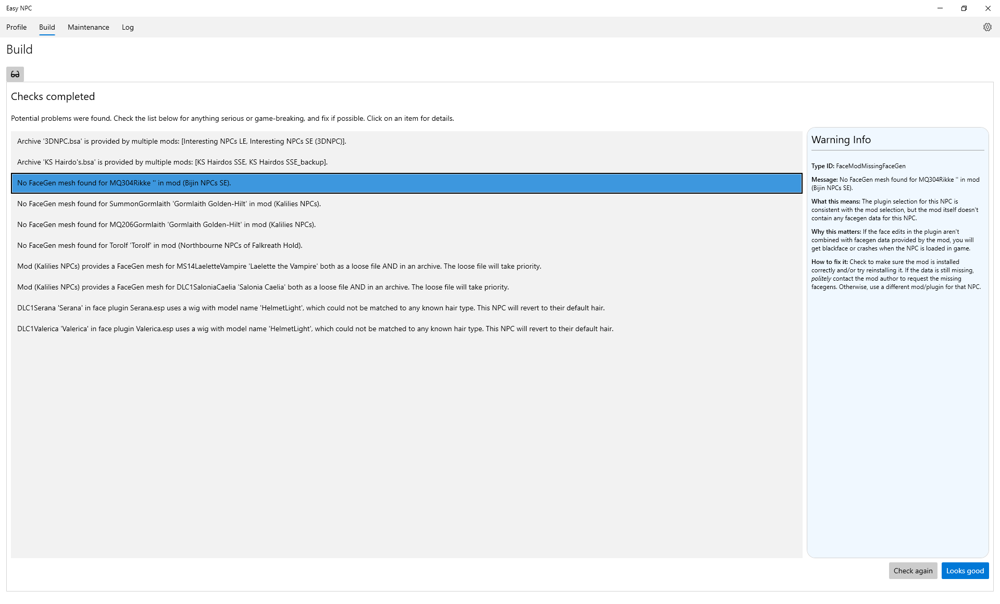

# Getting Started with EasyNPC

- [Installation](#Installation)
- [First Time](#First-time-use-and-load-order)
- [Profile](#Customizing-NPCs-(Profile))
- [Build](#Building-your-personal-mod)

## Installation

1. Download `EasyNPC-{version}.7z` from the [latest release](https://github.com/focustense/easymod/releases/latest) page.
2. Extract to any folder on your hard drive.
3. To get face previews in the app, download one or more [Mugshot packs](https://mega.nz/folder/KAxn2ARJ#NZQUN37_IwVDArs4DQ-tGQ) and extract them to the installation folder. (Note: These do not contain any original content from any mod, but are hosted off-site due to their size.)
4. Add Easy NPC [as an executable](https://github.com/ModOrganizer2/modorganizer/wiki/Executables-window) in Mod Organizer.
5. Prepare your load order for first-time use, as described in the following section.

## First-time use and load order

The optimal load order for EasyNPC is the same as the load order for SSE without any patches or add-ons for NPC overhauls. LOOT can generally be used as a starting point, but manual sorting is recommended for NPC mods:

1. Place all NPC overhauls near the bottom. The only plugins that load afterward should be generated patches (Bashed Patch, DynDOLOD output, etc.).
2. Order NPC mods by personal preference, from least to most important. In this context, "importance" is roughly equivalent to "number or proportion of faces that will be used".
   - This step is optional, and spending a lot of effort here is not necessary or recommended - it only determines what the initial selections will be, before any changes are made. Pre-ordering NPC mods means spending a few seconds now to save a few minutes later.
3. Deactivate any compatibility patches and All-in-One addons for NPC overhauls.
   - This is **not** optional. Compatibility patches can confuse EasyNPC and may cause it to identify the patches (or AIOs) as masters, and make it impossible to deactivate the overhauls or their patches afterward.
   - Only deactivate the patches for NPC _overhauls_ - not patches for other mods that just happen to touch NPCs. For instance, all [Patches for Northbourne NPCs](https://www.nexusmods.com/skyrimspecialedition/mods/48507) should be disabled, but not the [Legacy of the Dragonborn Patches](https://www.nexusmods.com/skyrimspecialedition/mods/30980).
   - AIO addons are those which require the original mods, such as [Bijin All-In-One](https://www.nexusmods.com/skyrimspecialedition/mods/11); these should be disabled. Full standalone mods that happen to have "AIO" in the name, such as [Pride of Skyrim - AIO](https://www.nexusmods.com/skyrimspecialedition/mods/48904), should be kept.
   - Rule of thumb: if a patch/plugin _depends on_ any of the NPC face mods as a master, it should be disabled. Otherwise, leave enabled.

Although step 3 may sound strange, even alarming, to veteran modders, be assured that EasyNPC will generate a plugin that resolves as many or more conflicts as those patches, because it understands the difference between face attributes and other attributes. It will not carry over behavior from face mods (i.e. revert to vanilla), nor will it carry over anything from behavior mods (e.g. extra/deleted head parts) that could affect the integrity of the face mod.

When the app is started for the first time, it will ask for your mods directory. Be sure to provide this! Although it can technically be skipped, very few features will work correctly without it. Afterward, it will display the current load order, where plugins can be selectively disabled or enabled for just this session; most of the time, you should ignore this and click "OK".

## Customizing NPCs (Profile)

The Profile tab is divided into 4 sections:

- Header
- Actor list
- Plugin list
- Previews/mod list

The header (top) includes a few high-level filters on the left, as well as buttons to Load or Save the profile on the right.

- _Show DLC Overrides_: includes NPCs that are **only** overridden by the Skyrim DLC (Dawnguard, Dragonborn, Hearthfires), and not any other mods.
- _Show Non-Conflicting Overrides_: includes NPCs that only have one mod available. Since it is still possible to revert to vanilla, this is enabled by default, but can be disabled if only interested in the NPCs supported by multiple overhauls.
- _Only Face Overrides_ - hides NPCs whose behavior is modified, but who don't have any face customizations available. Since the default plugin is chosen to be the last applicable one in the load order by default, there is usually no reason to look at them.

The NPC or actor list (left) shows all NPCs who are present in your load order and who have not been filtered, either by options in the header or by typing search text into one of the boxes at the top. Clicking on a line will bring up the details for that NPC.

The plugin list (right) shows all plugins that customize ("override") this NPC. Icons to the right of each plugin name will help identify which ones include face changes and which are the current default/master and face selections - hover over each icon for a description. Clicking on any plugin once will show the available actions, and also highlight the corresponding face preview in the bottom section.

The preview list (bottom) shows face previews for the combination of all mods in your Mod Directory (you did specify one when you started the app, right?) **as well as** any mugshots you downloaded for mods that are _not_ enabled or installed. These will be shown with the warning text "Plugin not loaded", "Mod not installed", or both. "Plugin not loaded" means you might have the mod but it is disabled, whereas "Mod not installed" means you don't have any mod in your Mod Directory by that name.

Clicking once on a preview will highlight the related plugin, if any is installed; double-clicking will choose the face from that mod/plugin combination.

**TIP:** If you're getting "mod not installed" because you have it installed under a different name - for example, "Bijin NPCs" instead of "Bijin NPCs SE" - you can make EasyNPC associate them by either renaming the mod, or renaming the folder inside `Mugshots` you extracted to the app folder. You need to restart the app if you rename the mod, but not if you rename the Mugshots sub-folder.

**ADVANCED:** Hold `Ctrl` while double-clicking a face preview, or when clicking "Set as face", to _stop_ EasyNPC from synchronizing your plugin and mod selection. This is normally not recommended, but can help resolve a few esoteric problems, such as a single mod providing multiple plugins that each modify the same NPC, or a mod that includes a "replacer" for another mod's ESP.

## Building your personal mod

When you first click on the build tab, it will ask to check for problems. It is strongly recommended that you do this, as there are many mods out there with unusual quirks.

Some warnings are more important than others. Refer to the [Build Warnings](build-warnings.md) documentation for more information - or click on an error to see a detailed description of what it means, how severe it is, and what you may be able to do about it.

False positives are possible, due to the complexity and quirkiness of the facegen system. You can always ignore the build warnings and continue anyway, with the risk being a blackface bug or, in the worst case, a crash affecting that specific NPC. Another option is to test the mod on its own, i.e. in an otherwise vanilla game - if it works in that scenario, it will work with EasyNPC. If a specific mod generates a lot of false positives and you are tired of seeing them - USSEP and CRF being common examples - then you can permanently ignore them on the Settings page:

After having resolved or chosen to ignore any warnings, click on "Check again" to re-run the checks, or "Looks good" to proceed with the build.

EasyNPC will put all generated content into a _new mod_, so that it can never corrupt any of your existing mods. Change the name of that mod here, or leave it as the default.

Using a new name for each build - or deleting the old one first - is recommended. While it is possible to skip the warning that shows up if a mod with that name already exists, you may end up with inconsistencies or leftover files from the previous build.

After confirming the mod name, the build starts and can only be stopped by exiting the program.

Once complete, exit the app and refresh your mod manager (F5 in Mod Organizer) to see the new mod. Remember to disable the original NPC overhauls after enabling the newly-built mod.

**TIP:** Activate the new mod, and disable the original ones, in a new Mod Organizer profile. This will make it much easier to rebuild or revert if any issues are found.

That's it! Enjoy your de-uglified gaming experience.