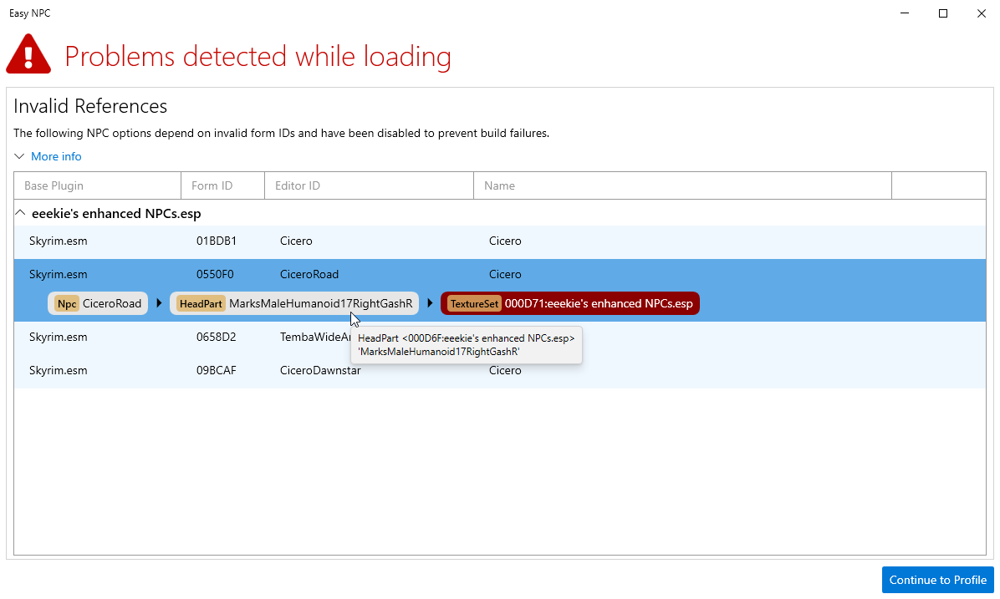
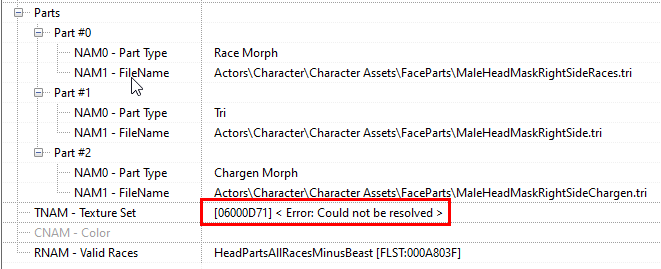
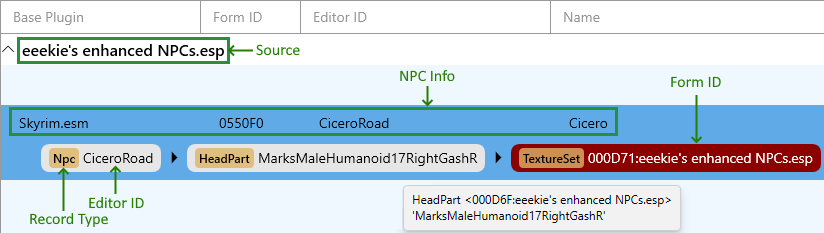
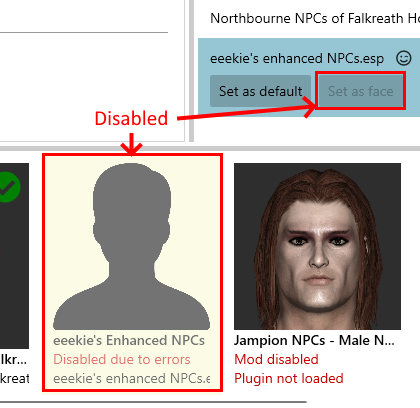

# Invalid References in Plugins

- [What is an invalid reference?](#what-is-an-invalid-reference)
- [What causes invalid references?](#what-causes-invalid-references)
- [Why does EasyNPC care?](#why-does-easynpc-care)
- [How do I interpret the errors?](#how-do-i-interpret-the-errors)
- [What can I do?](#what-can-i-do)
- [Disclaimer](#disclaimer)

As of version 0.9.3, EasyNPC comes with a new feature which does early detection of invalid form ID references in loaded plugins:

This feature now exists so that you aren't [surprised](https://github.com/focustense/easymod/issues/83) by [unexpected](https://github.com/focustense/easymod/issues/92) [errors](https://github.com/focustense/easymod/issues/102) when you try to build, without having received any prior warning. Those errors were a usability problem, and this feature should resolve it permanently.

## What is an invalid reference?

In Bethesda's plugin format (ESPs, ESMs, and so on), every _record_, such as an NPC, has a unique _form ID_ within that plugin. Fundamental to the modding concept is the ability of some records to _reference_ other records. For example, "Actor X uses hairstyle Y", where X is an _NPC_ and Y is a _head part_. Both X (NPC) and Y (head part) are records, and X references Y.

This reference is a combination of the plugin containing record _Y_ - which may or may not be the same as the one containing record _X_ - and the _form ID_ of record _Y_. This tells the game, as well as modding tools, how to find _Y_ when they start going through the details of _X_.

An "invalid" or "bad" reference is when _Y_ doesn't exist, or in even rarer instances, does exist but is the wrong type of record, e.g. Y was supposed to be a head part but is actually a weapon, or a cell. Less formally, the plugin containing _X_ is giving us bad directions.

---

These errors will be clearly visible in other modding tools as well, such as xEdit:

## What causes invalid references?

Mod authors don't intentionally put invalid references in their mods. In fact, it is quite rare for these errors to occur. Occasionally, the error is actually in the mod itself, as in the xEdit screenshot above. More often, this is user error.

The most common reasons for invalid references are:

1. Records were deleted from the target ("Y") plugin in xEdit, zEdit or a similar app. These tools will generally allow you to delete records which are still being referenced by other records, so modders who are not careful can end up with invalid references even from the _same_ plugin.

2. Records were _renumbered_ or _compacted_ (form IDs changed) in the target plugin, for example as part of the process to [convert a plugin to ESL-flagged](https://www.nexusmods.com/skyrimspecialedition/mods/21618). This situation is much easier to run into, even if the modder was careful, because while xEdit will maintain consistency of form IDs in all plugins _in your current load order_, it knows nothing about any plugins that are _not_ in the load order. If you renumber/compact form IDs and simply don't have one of the dependent plugins loaded, then that unloaded plugin will end up with invalid references. Similarly, if you renumber/compact a plugin and then later install a shiny new patch or expansion for it, you will find that none of the references line up properly.

3. One plugin is based on a much older/newer version of another plugin than the one that is actually installed. Few mod authors use [semantic versioning](https://semver.org/), and even fewer rename their ESPs when they've made major breaking changes to a mod, which is the generally-recommended practice. It may even be the case that one of the mods was converted a long time ago from Oldrim (Legendary Edition), before a Special Edition version of the mod was available, and some newer mod expects the SE version to be installed.

4. One of the mods in question is a merge created by a tool such as [zMerge](https://github.com/z-edit/zedit/releases), and either the "relink" functionality was not used, or the merge was regenerated without a subsequent relink. This type of problem is also likely to occur when anything depends on a Bashed Patch, Smashed Patch, Synthesis output, or any other dynamically-generated plugin in which form IDs are not stable. If the dynamic plugin is regenerated, then everything that depends on it _must_ also be re-generated, or else this issue will come up.

This may not be a complete list, but it represents the most common causes.

## Why does EasyNPC care?

EasyNPC's job is to give you a _standalone_ mod. If it is unable to follow all of the relevant references, it cannot perform its primary function. That is why _most_ functionality in EasyNPC is fault-tolerant and will simply ignore bad references, but the _build_ (or "merge") functions are not. Everything that is not vanilla must be copied into the mod, and if some of that is missing, the EasyNPC mod is guaranteed to be broken. The only question is "how broken".

_"Does this mean that **every** error in **every** plugin makes that plugin unusable? Everything must be absolutely perfect!?"_

No. EasyNPC only checks references originating from NPC records, and only those specific references that it needs to import in order for the face import to succeed. This includes indirect references, such as a texture referenced by a head part referenced by an NPC, but it does not include anything unrelated to NPC faces. In addition, only the specific NPCs with bad references in their path will be blocked - any other NPCs in the same mod will still be available, provided that their own references are valid.

The checking that is done is only the minimum required to prevent a "crash" during the build.

## How do I interpret the errors?

The figure below shows an annotated version of the error report.

Note the following information:

- **Source** is the plugin that is actually _affected_ by the invalid references. This is the plugin you will not be able to use (for this particular NPC).
- **NPC Info** provides the same basic information you'd see in the Profile view. It doesn't tell you anything about the problem itself, only which NPC is being affected by it.
- **Record Type**, **Form ID** and **Editor ID**, per "chip" (rounded rectangle) each identify a single record along the _path_. This is to help you identify _indirect_ references. It is always the _last_ item in this list ("target") that is actually the missing record - which is also why it will never have an editor ID - but because it can sometimes be hard to determine where the bad reference is actually coming from, the entire path is always shown.

In order to conserve screen space, for valid parts of the path (i.e. every item except the last one), only the Editor ID is shown, and not the plugin name, which can sometimes be quite long. Note, however, that while the Editor ID might look like a vanilla record, such as the `MarksMaleHumanoid17RightGashR` above, it may actually be a copy of this record in some other plugin. Hover over the chip to see a tooltip that includes all of this information: Plugin, Form ID and Editor ID.

For any given row in this table, it is always the last item that is actually missing, and the _second-to-last_ item which is _pointing_ to the missing record. The previous items do not matter, except to help explain to you how/why the NPC in question depends on this particular record.

## What can I do?

The answer to this will depend on what created the problem in the first place, and your level of familiarity and experience with modding tools.

A good first step in troubleshooting is to reinstall both the source mod - i.e. the one containing the NPC customization - and the target mod (the one with the missing record), if the target is different from the source. In the example above, both the source and target are the same mod, but as described in [causes](#what-causes-invalid-references) above, they may be different. If they are different, check the mod page for the source to see if the author has mentioned anything about version requirements or compatibility.

If the entire path is in a single mod (as in the example above), and you've re-downloaded/re-installed the mod to ensure that it hasn't been tampered with in any way, then you've found a bug in the mod, and should _politely_ report it to the author. The author may then recommend a workaround, or if you are very familiar with what the mod does, then you may be able to think of your own workaround, such as deleting the bad reference if that was likely to have been the author's original intent.

If any merges or dynamic patches are involved, you should regenerate or rebuild all of them from scratch, starting from the right side and moving to the left, which represents the order of your dependencies. Similarly, if you've compacted form IDs on some of the plugins in order to ESLify them, you will have to revert back to the original versions of those plugins _and any other plugins that depend on them_, and then compact again with your entire load order active to make sure all references are properly updated.

You always have the option of ignoring the errors and clicking "Continue". The app will continue to run, but you will not be allowed to choose any of the affected options - they will instead be grayed out:

> <kbd></kbd>

Aside from being unable to select these specific options, there will be no difference in functionality.

## Disclaimer

✋ **If you are trying to manage an extremely large load order**, e.g. pushing 500+ plugins, and have been unable to resolve it using any of the above steps: please understand that the level of experience required to _modify_ a highly complex premade installation (Wabbajack list, Lexy's guide, etc.) is vastly greater than that required to _install_ it, or even to start fresh from a much smaller mod list. EasyNPC did not create the problem, it is only telling you that you have this problem. Please do not file bug reports or ask for support unless you can provide conclusive evidence that the information reported by EasyNPC is actually incorrect.

If you don't know how to fix the problem, the "correct" answer is to either not use the problematic mod at all, or not use the broken NPC options. This guide is provided in order to explain how the error-detection works and provide some very basic strategies, but does not represent a commitment to help individual modders fix every issue. Thank you for your understanding.