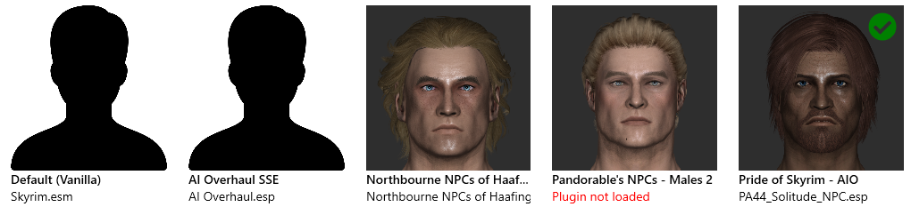

# How to Create a Mugshot Pack

Face previews, AKA mugshots, are the fuel that powers the preview section of the NPC editor:

<kbd>
    
</kbd>

<p></p>

Without a mugshot, face options will show as a generic silhouette, as we see for "AI Overhaul SSE" above.

This guide is for mod authors, enthusiasts, and anyone else interested in creating their own mugshots for use by EasyNPC.

There are two main aspects to a mugshot pack: the file paths, and the images themselves.

## Structure of a Mugshot Pack

Files in a mugshot pack are laid out very similar to facegens themselves:

```
Mugshots
├── <Mod Name>
│   ├─── <Plugin Filename>
│   │    ├─── <NPC FormID>.png
│   │    └─── <NPC FormID>.png
│   └─── <Plugin Filename>
│        ├─── <NPC FormID>.png
│        └─── <NPC FormID>.png
└── <Mod Name>
    ├─── <Plugin Filename>
    │    ├─── <NPC FormID>.png
    │    └─── <NPC FormID>.png
    └─── <Plugin Filename>
         ├─── <NPC FormID>.png
         └─── <NPC FormID>.png
```

The "Mugshots" root is optional, but recommended to stay consistent with other packs. The other variables are:

- **Mod Name:** The exact title of the mod on Nexus, e.g. "Bijin NPCs SE". If it is not a Nexus mod, and has to be installed manually from a zip/7z, then the best choice is usually the file name (not including the .zip/.7z extension). _Choose wisely, otherwise users will have to [set up synonyms](mugshot-matching.md) in order to see them properly_.

- **Plugin Filename:** The name of the plugin, such as `Skyrim.esm` or `Dawnguard.esm`, where the NPC originates. This is **not** the plugin provided by the mod above, it is the "source" of the NPC. Most vanilla NPCs come from `Skyrim.esm`, Serana comes from `Dawnguard.esm`, all Interesting NPCs come from `3DNPC.esp`, and so on.

- **NPC FormID:** The ID of the specific NPC being modded, with "00" as the first two digits. For example, if it appears in xEdit as `0401CAA8`, the actual ID to use in the filename is `0001CAA8` (starting with 00, not 04). The boring technical reason for this is that the first two digits refer to the plugin's position in your load order at that time, and the facegen files are not load-order dependent, therefore the position bits are always zeroed out.

Example of (part of) a mugshot pack with real names:

```
Mugshots
├── Fresh Faces - SSE
│   ├─── Dawnguard.esm
│   │    └─── 0001541c.png
│   ├─── Dragonborn.esm
│   │    └─── 00017934.png
│   ├─── HearthFires.esm
│   │    └─── 00005215.png
│   └─── Skyrim.esm
│        ├─── 000a2c8e.png
│        ├─── 000a2c8f.png
│        ├─── 000b8827.png
│        └─── (more files)
└── Improved Bards - Special Edition
    ├─── HearthFires.esm
    │    ├─── 00018DE0.png
    │    ├─── 00019630.png
    │    └─── 00019631.png
    ├─── IB - All-in-One.esp
    │    └─── 0000132D.png
    └─── Skyrim.esm
         ├─── 0001A670.png
         ├─── 0001AA63.png
         ├─── 00047CAD.png
         ├─── 00083D99.png
         └─── (more files)
```

---

💡 **TIP:** Create the folder structure (mod names and plugin names) before starting on any individual mugshots. The reasons for this will become clear in the next section.

---

## Taking Mugshots

Until some method is found to fully automate the process, mugshot creation is a tool-assisted manual process. Initial setup normally takes a few minutes, and afterward, about 20-30 seconds per modded NPC - maybe more if you are a perfectionist. The text describing the process is long, but the actual process is short, once you are used to it.

### Required Tools

- [NifSkope](http://niftools.sourceforge.net/wiki/NifSkope)
- [7zip](https://www.7-zip.org/)
- [Bethesda Archive Extractor](https://www.nexusmods.com/skyrimspecialedition/mods/974/) or [BSA Browser](https://www.nexusmods.com/skyrimspecialedition/mods/1756)

### Optional/Recommended Tools

- [MugPrep](https://github.com/focustense/easymod/tree/develop/Focus.Tools.MugPrep)
- [Greenshot](https://getgreenshot.org/)
- [ScreenMarker](https://screenmarker.en.uptodown.com/windows)

### Preparing Facegens

First, **make a backup of the mod** unless it can be reinstalled easily (no FOMOD options, patches, etc.). Some of these steps could affect the performance or reliability of the mod in-game, and might be difficult to undo manually.

**If the mod has BSAs:**

First, check if the mod _also_ has loose files. Sometimes, these are patched in to overwrite files in the BSA, and you don't want them to be lost when you extract the BSA. If the mod directory contains "meshes" or "textures" directories, move them somewhere else temporarily - anywhere is fine, including your desktop.

Next, extract the BSAs into the mod directory, using BAE or BSA Browser. You should end up with _new_ "meshes" and/or "textures" directories in the mod. If you moved existing meshes/textures in the previous step, move them back into the mod folder now, and if Windows Explorer asks you to overwrite, say "yes to all".

You now have a 100% loose mod. You can delete the BSAs, although it is not necessary - you're going to restore from backup or reinstall the mod afterward anyway.

**After BSA unpacking, or if there weren't any BSAs:**

Run MugPrep on the mod using the following command: `MugPrep -d "C:\Path\To\Mod"`

Replace with the actual path (obviously) which you can copy from the Windows Explorer path box. **Mod Organizer users should run this in VFS**, because although it takes a direct path to the mod, it may need access to game assets to perform some of its fixes. To run with VFS, either add it as a tool directly to Mod Organizer (don't forget the arguments!), or add the command prompt (`cmd.exe`) to Mod Organizer and run the MugPrep command from that prompt. Vortex users, or anyone not using Mod Organizer specifically, do not need to worry about this.

Assuming it runs without any errors, you're ready to start capturing the mugshots.

### Preparing for Screenshots

This is an optional step if you are using Greenshot and ScreenMarker as described above. These should make your life a little easier, especially if you are going for the same level of consistency in your mugshots as the "official" packs. However, if you don't want to use these tools, or you have a process you prefer, you can skip this step or substitute your own.

1. Start ScreenMarker, and use it to draw a square somewhere on your screen. This will be your "frame" for positioning the faces in NifSkope later on.
   - Official mugshots are approximately 625x625, but this dimension is arbitrary and you don't need to use that exact width/height - just make sure it is square.
   - One way to get a "perfect" frame is to open up a different app like MSPaint or Paint.NET, use it to draw a square, and then use ScreenMarker to draw a square around that.
   - Note that ScreenMarker doesn't allow you _move_ what you've drawn, so make sure it is really where you want it!

2. Capture the area _inside_ your frame, one time, using Greenshot.
   - Press the <kbd>PrtScrn</kbd> key, which will give you a crosshair and a convenient magnifier, so you should be able to easily get the exact area inside the frame, not including the frame border itself.
   - After capturing, Greenshot will pop up a menu asking what to do with your capture. For now, don't do anything, just click "Close".

Now you're ready to start making mugs.

### Capturing Mugshots

We will use NifSkope to render the facegens on screen. The process will be slightly different for Mod Organizer vs. other mod managers (or no mod manager). These steps will go into very fine detail, including specific clicks and key presses, because they are optimizing for literal seconds per NPC, which add up to a lot of time when processing hundreds or thousands of NPCs.

1. Find (but don't open yet) the facegen files in the mod. These are always in the following subdirectory: `meshes\actors\character\FaceGenData\FaceGeom\<Plugin Name>` and are named `<FormID>.nif`.
  - **Mod Organizer users:** Use the **Data tab** in Mod Organizer to find these files. It's important that you open these with VFS.
  - **Other users:** Just navigate to the facegen directory in Windows Explorer.

2. **Copy** the filename to clipboard, so you don't need to remember or retype the Form ID later on.
   - In Mod Organizer, you can do this by clicking on the file name (not anywhere in the file row, but specifically on the _actual name_), and pressing <kbd>Ctrl</kbd>+<kbd>C</kbd>.
   - In Windows Explorer, you can select the file and use this sequence of keyboard shortcuts: <kbd>F2</kbd>, <kbd>Ctrl</kbd>+<kbd>C</kbd>, <kbd>ESC</kbd>. (You can also use the mouse exclusively, but keyboard shortcuts are much faster.)
   - Note that Mod Organizer users will get the file name _with_ extension (NIF), and other users will get the filename _without_ extension. This makes very little difference, just remember it for later.

3. Open the facegen in NifSkope.
   - **Mod Organizer users:** Right-click the file, select "Open with vfs".
   - **Other users:** Double-click the file.
   - If you've never opened a NIF before and get asked what to use to open the file, then locate NifSkope and choose it as the program.
   - The very first time you open NifSkope for a new mod, it's possible you'll see purple textures due to missing BSAs, such as those for KS Hairdos. If you see this, click the _Options_ menu, choose _Settings_, select the _Resources_ item on the left side, click the _Archives_ tab on the right side, and click the "Auto Detect Archives" button at the far right. It should add several archives from your current load order. Afterward, click "Close", and the missing/purple textures should be resolved. If not, this requires NifSkope-specific troubleshooting that is out of the scope of this guide.
   - MugPrep should have fixed the bone transforms (and maybe other issues) for you. If the face you see is badly deformed or otherwise unusable, please report it as a bug, and include the name of the mod and ID of the NPC that was affected.
   - ❗ NifSkope isn't connected in any way to the game data; therefore, it will render whatever texture paths are currently in the NIF file, as opposed to any texture overrides that might be specified in the mod. Usually, this is good enough; in some rare cases, it might not be. If the default texture paths are simply not appropriate, then you will need to replace them on the corresponding `BSShaderTextureSet` nodes in NifSkope, and unfortunately there is not currently any way to automate this. (It may someday be added as a feature to MugPrep)

4. Take your screenshot. If using the recommended Greenshot + ScreenMarker combo:
   - Center and zoom the NPC face so that it fills the frame. You'll want the bottom of the neck to go outside the frame, so that the captured face does not actually look like a disembodied floating head.
   - Zooming in NifSkope can be done with the mouse wheel (coarse) OR by holding down the right mouse button and dragging (fine). Panning/moving is done by holding down the middle mouse button and dragging.
   - Press <kbd>Shift</kbd>+<kbd>PrtScr</kbd> to tell Greenshot to capture _exactly the same area that was previously captured_, i.e. the area that is inside the frame.
   - Choose "Save as (displaying dialog)" from the Greenshot popup menu.
   - If this is your first screenshot, then navigate to the corresponding mugshot directory you set up for this mod/plugin. If you've already taken a previous screenshot, then you should already be in that directory.
   - Paste (<kbd>Ctrl</kbd>+<kbd>V</kbd>) the Form ID or file name you copied from step 2 into the "File name" box. If using Mod Organizer, this will still have the ".NIF" extension; remove it (pressing <kbd>Backspace</kbd> 4 times is most efficient).
   - Press <kbd>Enter</kbd> to save the capture. You do **not** need to enter the `.png` extension, Greenshot does that automatically for any file name you enter with _no_ extension.
   - **💡 TIP:** Have an Explorer window open to the mugshot directory you're saving files to, set to "Extra large icons" as the view. This will give you instant feedback on whether or not the screenshot you just captured is "good".
   - If at any time you mess up Greenshot's settings, and it is no longer picking up the content inside the frame, just press <kbd>PrtScr</kbd> again (without the <kbd>Shift</kbd>) to put it back, as you did in step 2 of "Preparing for screenshots".

5. Close NifSkope, select the next NPC, and repeat from step 2.

6. If the mod changes NPCs coming from multiple plugins (such as Skyrim.esm and Dawnguard.esm), make sure you are using the same mugshot directory as the facegen directory - i.e. save the mugshot for `FaceGeom\Dawnguard.esm\0012345678.nif` as `<ModName>\Dawnguard.esm\0012345678.png`, and save the one for `FaceGeom\Skyrim.esm\0012345678.nif` as `<ModName>\Skyrim.esm\0012345678.png`.

### After capturing

Once you have all the mugshots, use 7zip to make an archive of the top-level `Mugshots` directory. If you are making mugshots for several smaller mods, especially if those mods are from the same author, it's recommended that you package these all in a single archive; each subdirectory under `Mugshots` contains the previews for one of the included mods.