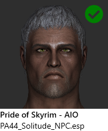
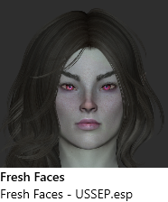
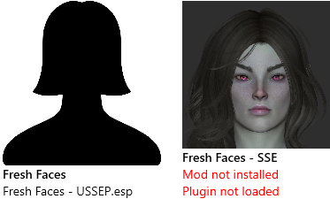
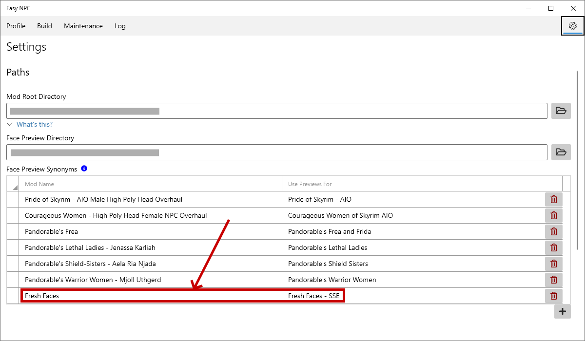

# Matching Face Previews

Face previews, or "mugshots", help to visualize what an NPC will look like when a certain mod is used for them.

> 

This page will explain how these mugshots are organized and displayed, and what you can do if you are seeing what appear to be incorrect or unhelpful results in the mugshot panel of the Profile page.

## Mugshot packs

A mugshot pack is simply an archive containing images, either provided [by the EasyNPC author](https://mega.nz/folder/KAxn2ARJ#NZQUN37_IwVDArs4DQ-tGQ) or by a mod author or other third party. Every pack has the same structure:

- A top-level directory named `Mugshots`
- A single subdirectory for each mod* that is covered by the pack.
- One or more subdirectories for each master plugin where the NPCs were originally created.
- Image files in each plugin subdirectory corresponding to the _local Form ID_ (always starting with "00") of the customized NPC.

* _Mod_ as used in the context of EasyNPC refers to the package, e.g. a mod page on Nexus Mods and all of the contents of any files that were downloaded and installed from that page. It does _not_ refer to a plugin (.esp/.esm), which is the definition that users of Mutagen/Synthesis might be familiar with. EasyNPC uses Mod Organizer's definition of a "mod".

Concrete example:

    Mugshots
    ├── Fresh Faces
    │   ├─── Dawnguard.esm
    │   │    └─── 0001541c.png
    │   ├─── Dragonborn.esm
    │   │    └─── 00017934.png
    │   ├─── HearthFires.esm
    │   │    └─── 00005215.png
    │   └─── Skyrim.esm
    │        ├─── 000a2c8e.png
    │        ├─── 000a2c8f.png
    │        ├─── 000b8827.png
    │        └─── (more files)
    └── Improved Bards - Special Edition
        ├─── HearthFires.esm (...)
        ├─── IB - All-in-One.esp (...)
        └─── Skyrim.esm (...)

Experienced modders may recognize this as being very similar to Bethesda's own facegen tree, with one level added at the top for mod name. This is not accidental; using this structure isolates mods from each other, allows us to work both forward _and_ backward to determine the mod name, plugin name and specific NPC (form ID). It also supports some advanced potential future uses, such as integrating with Mod Organizer's vfs to allow overriding mugshots.

One important limitation of this system, and of Bethesda modding in general, is that _there is no universal way to identify a "mod"_. There is the Nexus ID, but not all mods are hosted on Nexus Mods, and even mods that originally came from there might be manually installed and lose this information. Consequently, the scheme used by EasyNPC is to match the mod name used by your mod manager - that is, the _directory_ in which the mod is installed - with the mugshots. Most of the time, this will just work, but there are some caveats, especially if you've opted not to use the "default" names when installing mods.

## How mugshots are displayed

When you click on an NPC in EasyNPC, it uses a process similar to the following to display previews:

1. Locate and display all mugshots for the given NPC (by source plugin and form ID), working _backward_ to determine if the corresponding mod is actually installed.
2. Take all active plugins that modify the NPC, and work _forward_ to determine the mod name and whether or not any mugshots can match. If there is no matching mugshot, display a placeholder image.
3. Add a placeholder for the master/vanilla plugin, if not already covered by the above.

Thus, if you've installed a mugshot pack, then those mugshots will _always_ get displayed, regardless of the current state of your game or mod list. However, you will see additional placeholder mugshots for any non-covered mods you have installed, in order to make certain that you are still able to use these mods.

## Failure to match

Let's say that you've installed _Fresh Faces - SSE_ as in the example above, but you've installed it under the abbreviated names _Fresh Faces_. EasyNPC does not know that these are the same mod, so instead of seeing this:

> 

You will see this:

> 

Although it may appear confusing, the result of a mismatched mod name is almost always the same. There will be one tile with a placeholder image that indicates being available, and another tile with the correct mugshot that shows as not installed/loaded. This happens because EasyNPC is seeing the mugshot and the mod as being two different entities.

To fix failed matches, you need to tell EasyNPC that they are actually the same entity.

## Fixing match failures

There are now 3 different ways to fix mugshot mismatches:

1. **(Recommended)** Configure a synonym or "redirect" in the application settings.

    

    This tells EasyNPC that the two mod names are one and the same, and that any time you have a mod named "Fresh Faces", it is allowed to show the previews for "Fresh Faces - SSE" instead. When you add an entry, EasyNPC will auto-complete or allow you to select the mod names and mugshot names from a list, so you know that they are correct.

    Using this option is also immediate - you don't need to restart EasyNPC. When you go back to the Profile tab, you will start seeing the correct previews. (You might need to "refresh" by clicking on a different NPC, and then again on the one you want.)

2. Rename the Mugshot folder.

    Since the mugshot packs are just folders and files, you can rename the "Fresh Faces - SSE" folder to "Fresh Faces". Like option 1 above, this change has immediate effect, because EasyNPC does not cache mugshots.

    The biggest drawback of this is updates. If the pack is ever re-released - i.e. because the mod itself has been updated with new looks or new NPCs - then you would have to remember to rename the new folder after extracting it.

3. Rename the mod.

    This may not be possible in all mod managers. Mod Organizer can rename mods quite easily, but in Vortex, the mod name is actually obtained from Nexus, never shown to the end user and generally not possible to change. In addition, changing the name of a mod **does** require a restart of EasyNPC, because mod names **are** cached.

    Although usually not recommended, this could be the better option if you already have a different reason to rename the mod, e.g. if it was installed under a nonintuitive or confusing name.

## Other quirks

If the above solutions haven't helped you or don't seem to apply, check the following Q&A: [Why aren't these mods/plugins being detected?](https://github.com/focustense/easymod/discussions/23).

This thread covers some of the more unusual scenarios, for example:

- Patches, updates and optional files being installed as separate mods. This is not supported very well by EasyNPC _or any other merge tool_. If using Mod Organizer, you should use the _merge_ option instead; in Vortex, they must be installed separately, but the grouping is handled automatically by the EasyNPC extension.

- Mods that _only_ modify facegens. These are currently not supported, because (a) EasyNPC relies on plugin records to find NPC customizations, and (b) even if it were changed to incorporate loose facegens, this could be inherently unsafe because there is no way to determine the correct vanilla master or default head parts.

- Inactive or disabled mods, Mod Organizer backups, etc., may also show up with other mugshots, because EasyNPC currently does not detect whether or not the mods are active, only whether or not their plugins are active. This is expected to be resolved eventually, somehow - but in the meantime, you should simply ignore these, or delete the old backups/unused mods if you are no longer using them.

Consult the Q&A for more issues, recommended workarounds, and updates.